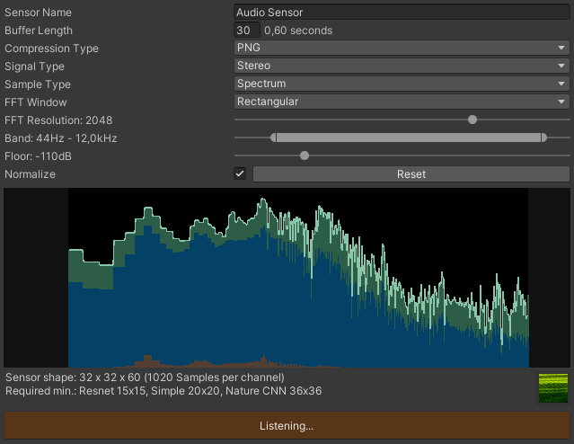
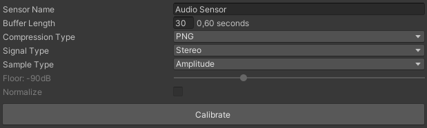
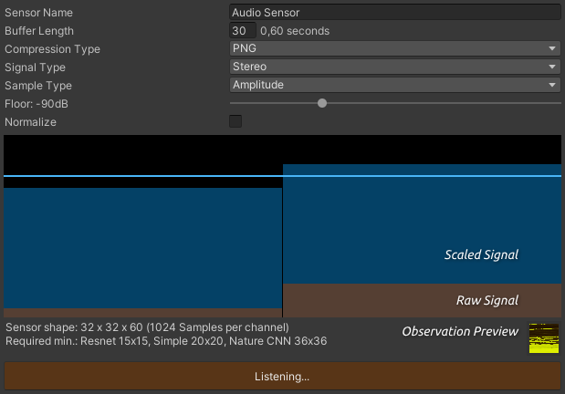
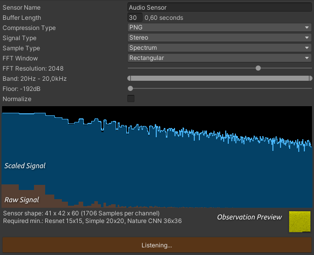
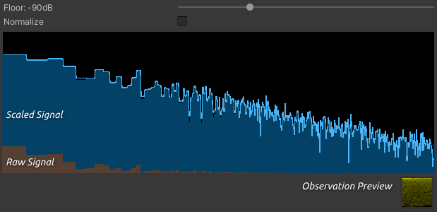
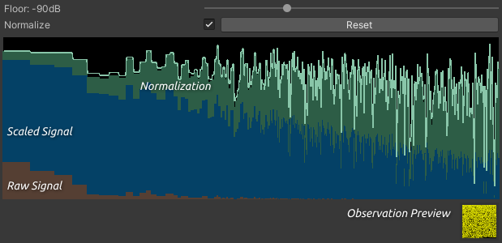

# Audio Sensor for Unity ML-Agents
This is an experimental audio sensor for the [Unity Machine Learning Agents Toolkit](https://github.com/Unity-Technologies/ml-agents). 

* [Concept](#Concept)  
* [Limitations](#Limitations)
* [Settings](#Settings)
* [Calibration](#Calibration)
* [Examples](#Examples)
* [Issues](#Issues)
* [Demo Video](https://www.youtube.com/watch?v=98otXDE1TgI)
<br/><br/>


<br/><br/>

## Concept

The [AudioSensorComponent](https://github.com/mbaske/ml-audio-sensor/blob/master/Assets/Scripts/AudioSensor/AudioSensorComponent.cs) is responsible for sampling in-game audio and for writing the processed samples to the [AudioBuffer](https://github.com/mbaske/ml-audio-sensor/blob/master/Assets/Scripts/AudioSensor/AudioBuffer.cs). It wraps the [AudioSensor](https://github.com/mbaske/ml-audio-sensor/blob/master/Assets/Scripts/AudioSensor/AudioSensor.cs) which in turn reads from the buffer and generates observations. Audio signals have to be sampled continuously - splitting the sensor code this way serves to decouple the sampling frequency from the agent's decision interval.
To that end, the sensor component implements its own updater, triggered by the Academy's `AgentPreStep` event. Agent steps execute on the FixedUpdate loop, every 20ms or at 50fps with default time settings.
<br/><br/>

## Limitations

Audio in Unity runs on its own thread, unaffected by the the global [time scale](https://docs.unity3d.com/ScriptReference/Time-timeScale.html), which is usually increased in order to speed up training. Therefore agents listening to audio must be trained in real time.

There can only be one [audio listener](https://docs.unity3d.com/ScriptReference/AudioListener.html) in a scene, which means training and inference are limited to a single agent per environment - *if* that agent can influence the audio it listens to (like changing its position relative to a sound source).

Training with multiple agent instances is possible, as long as the observed audio is unaffected by their actions. In that case, adding a sensor to every agent would be pretty wasteful however, because each individual sensor instance would process identical signals. A more resource frienly approach is using *audio sensor proxies* instead. A sensor proxy merely refers method calls to a central audio sensor, which is attached to only one of the agents. This agent's sensor caches its observations, so they can be accessed by the proxies. The only catch here is that sensors are queried in the same order as agents were originally enabled. Therefore you'll need to make sure the listening agent is enabled first. I recommend keeping all other agents disabled by default, and letting the [ProxyEnabler]() script activate them automatically. The [speech recognition example](#Examples) uses this approach.
<br/><br/>

## Settings 

### Buffer Length

The audio buffer length is set in update steps, with a single step normally spanning 20ms. Let's call all audio gathered within those 20ms a *sample batch*. The number of sample batches is equivalent to the number of channels in a tensor shape (multiplied by 2 for stereo signals), e.g.:
```
Mono:   10 batches * 1024 samples => 10 channels * 32 (width) * 32 (height)
Stereo: 10 batches * 2048 samples => 20 channels * 32 (width) * 32 (height)
```

When sampling spectrum data, a batch contains values for a set number of frequency bands, representing a spectrum snapshot over that time period. If we sample raw amplitude values on the other hand, the number of samples depends on the system's sample rate. Unity on Windows uses 48kHz, a 20ms batch should therefore contain 48000 * 0.02 = 960 samples per channel. However, [GetOutputData](https://docs.unity3d.com/ScriptReference/AudioListener.GetOutputData.html) requires sample sizes of a power of 2, so we actually sample 1024 values, resulting in a small overlap between batches. Alternatively, one could fill the buffer from the audio thread, using [OnAudioFilterRead](https://docs.unity3d.com/ScriptReference/MonoBehaviour.OnAudioFilterRead.html). I've opted for the main thread though, because it's easier to keep sample data synced with the agent loop this way.

Since the audio sensor component implements its own update mechanism based on `AgentPreStep` events, I recommend binding agent decisions to those updates, rather than using the ML-Agents decision requester component. The audio sensor component dispatches a `SamplingUpdateEvent`, containing the current sampling step count with respect to to the buffer length. The agent should listen to this event and request decisions accordingly, as the latest batch of audio samples will be available when it is invoked. Check out the [example projects](#Examples) for how this can be implemented in practice.

To enable **observation stacking**, set the buffer length to `decision interval * stacking size`. Buffer contents are read from oldest to newest. With a decision interval of 5 and a buffer length of 10 for instance, the agent would observe the following sample batches, corresponding to a stacking size of 2.
```
Agent step    Sampling step    Batch indices in buffer (oldest to newest)

 0            0                1*  2*  3*  4*  5*  6*  7*  8*  9*  0
 5            5                6*  7*  8*  9*  0   1   2   3   4   5 
10            0                1   2   3   4   5   6   7   8   9   0' 
15            5                6   7   8   9   0'  1'  2'  3'  4'  5'

* empty batch
' overwritten with new samples
Sampling steps 1 to 4 and 6 to 9 execute between agent decisions.
```

### Compression Type

Whether to use PNG compression for the observations. Doing so can reduce data sizes and speed up training, but it will also limit the signal's dynamic resolution to 8 bits.

### Signal Type

Whether to observe the left and right audio channels separately (stereo) or combined (mono, L+R mean value). `Stereo` always doubles the observation size compared to `Mono`.

### Sample Type

Whether to sample spectrum or amplitude data. `Spectrum` allows for fine-tuned control over the observed frequency range and can help reducing observation sizes this way. It is less accurate with regard to timing though, as spectrum data represents a 20ms snapshot. I'm not sure how well Unity simulates interaural time differences for stereo signals, but 20ms would normally be way too long of an interval for discerning where a signal is coming from. The agent can only rely on level differences between the left and right channels for localizing an audio source. The `Amplitude` option should be more precise in this regard, but it has a fixed sample size and doesn't support constraining the observed frequencies. Then again, you could just add low and high pass filters to the audio listener for that.

### FFT Window

Sets the spectrum analysis windowing type. Use this to reduce leakage of signals across frequency bands.

### FFT Resolution

Sets the number of FFT bands when sampling spectrum data (64 - 8192). This is the number of bands which are sampled, *not* the number of bands being observed. 

### Band

Sets the minimum and maximum frequencies for constraining the observed FFT samples. Note that this is not an audio filter, but a hard cut with respect to the FFT bands included in the observations. The precision can only be as high as the selected FFT resolution. Adjusting frequencies that lie within the same FFT band has no effect. Leakage from neighbouring bands may depend on the selected FFT window.

### Floor

Sets the minimum decibel level for scaling sample values. The raw sample values can be pretty low, especially for spectrum data. In order to get a better dynamic range, values are scaled up as follows (I'm calling the spectrum values 'amplitudes' here as well).
```
dB = 20 * log10(raw amplitude)
scaled amplitude = max(dB, floor) / -floor + 1
```

### Normalize

Whether to normalize the samples. Normalization is implemented as upward expansion over the full dynamic range, based on the measured signal peaks. When sampling spectrum data, each FFT band is normalized individually.
```
normalized amplitude = scaled amplitude * 0.99 / measured peak of scaled amplitudes
```
<br/>

## Calibration

Click the `Calibrate` button and enter play mode to start fine-tuning the sensor with game audio. Aim for a sufficiently dynamic signal in order to utilize the observable value range from 0 to 1.



 The graph for `Amplitude` sampling displays the RMS (root mean square) value of the latest sample batch and therefore smooths out signal peaks.



A low `Floor` value results in a higher average level, but with little dynamic range. Here's an example of brown noise spectrum data, scaled with the smallest floor value. 


Upping the floor value increases dynamics, quieter signals might disappear though. Tweak this value with different sounds the agent is expected to hear during training, in order to achieve an expressive dynamic range. The observation preview texture reflects signal dynamics as well.



For normalizing samples, the sensor needs to detect their peak values first. A flashing red bar at the top of the graph indicates that normalization is currently being fitted to the signal. Press the `Reset` button to clear all measured peaks and start over. Changing `Signal Type`, `FFT Window`, `FFT Resolution` or `Floor` settings will also invalidate the current values.

Normalization *increases* the dynamic range, as it multiplies sample values with an expansion factor.



**Don't forget to copy your updated settings with 'Copy Component' while still in play mode. Back in editor mode, save them with 'Paste Component Values'.**

Note that any changes which result in a different observation size can cause errors if the agent is in training or inference mode, because the model then no longer matches the new settings.

Calibration creates some overhead at each sampling step and should be disabled during training.
<br/><br/>

## Examples

The project includes two example environments, demonstrating different approaches to generating agent decisions using audio observations only.

### Speech Recongition

The agent has to recognize spoken numbers between 0 and 9. The data set consists of 15 different synthetic voices (OS X text to speech). I've trained the agent on 13 of them, using a discrete action space for matching actions to numbers. It receives a reward for every correct guess, an episode lasts for 100 decisions. At inference, the agent is tasked with recognizing numbers read by the two remaining  voices it hasn't heard before. The success rate is around 90% for the unknown voices and close to 100% for the training set, not too bad. Admittedly though, I've made things a little easier for the agent by timing decisions with the audio and by setting the buffer length to the maximum clip duration of 0.6 seconds. This way, the agent receives piecemeal observations and doesn't need to detect the numbers in a continuous audio stream.

### The Cat Localizer

A meowing cat and a barking dog are moving around constantly. The stationary agent was trained to rotate itself and face the cat as often as possible, using a continuous action space. The more precisely it points towards the cat, the higher the reward. This is more challenging than the first example insofar as the agent not only has to distinguish the meows from the barks, but it also needs to track the cat's ever changing position, based on left and right level differences in the observed spectrum data. Sounds are played at random, therefore the agent must pick up on meows in continuous audio. It makes decisions every 5 steps, the buffer length is set to 50 steps (one second), which corresponds to stacking 10 observations.
<br/><br/>

## Issues

Since training is limited to one agent in real time, I was hoping to at least train with multiple executables in parallel. However, launching even a single exe from the python console quit with an EOF / broken pipe error. I wonder if there might be something off with my observation encoding or PNG compression - although strangely, I haven't had any problems when training in the Unity editor. [These](https://github.com/Unity-Technologies/ml-agents/issues/4061) [issues](https://github.com/Unity-Technologies/ml-agents/issues/3805) sound like they could be related, but I'm not sure. Please let me know if anyone has some insight into what might be causing this.

The application target framerate has to match the capture framerate. Failing to set the correct target framerate causes the [fixed unscaled delta time](https://docs.unity3d.com/ScriptReference/Time-fixedUnscaledDeltaTime.html) to be shorter than expected, resulting in audio weirdness ([related issue](https://github.com/Unity-Technologies/ml-agents/issues/1302)). This threw me off at first, now I always pass `--capture-frame-rate=50 --target-frame-rate=50` with my mlagents-learn parameters. I picked 50 fps because it matches the fixed update loop, but 30 or 60 fps should also be fine, as long as both numbers are the same.
